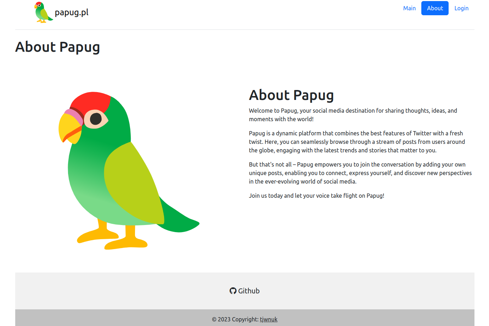

# Papug
Yet another twitter clone\
Current version is located in branch develop.

---

© 2023 Tomasz Wnuk\
https://github.com/tjwnuk \
tjwnuk@proton.me

---



## Features

* List all posts on homepage
* Authorization, user accounts and logging in and out
* Adding new posts
* Posts contain title, content, date when created and username
* Display user's post on his profile

## Install

```bash
cd /your/code/directory
git clone git@github.com:tjwnuk/papug.git
```
* install postgres, create database papug with user papug and password papug, all of this can be configured in /src/main/resources/application.properties
* when initializing the database change spring.sql.init.mode to always in /src/main/resources/application.properties
```spring.sql.init.mode=always```
then set it back to "never"
```spring.sql.init.mode=never```
* run app either in IDE or command line by typing
  ```./mvnw spring-boot:run```
* enjoy!

## Default users
The database is initialized with set of default users

Username |     Password | Role
| :--- |-------------:| :---:
admin  |         pass | ROLE_ADMIN
user  |         pass | ROLE_USER
alice  |         pass | ROLE_USER
bob  |         pass | ROLE_USER